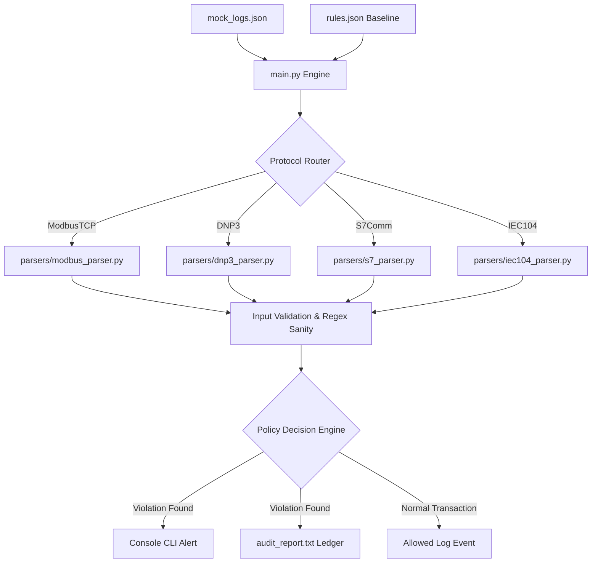

# Multi-Protocol ICS/SCADA Network Compliance Auditor

A modular, lightweight, passive security compliance auditing engine designed to analyze Modbus TCP, DNP3, Siemens S7Comm, and IEC 60870-5-104 (IEC 104) network telemetry logs for operational anomaly detection and regulatory compliance under NCIIPC guidelines.

[](https://github.com/Namanbhatt-01/ics-defensive-parser/actions)
[](https://codecov.io/gh/Namanbhatt-01/ics-defensive-parser)
[](LICENSE)
[](SECURITY.md)

---

## 📌 Project Overview

Critical Information Infrastructure (CII) assets like electrical grids, water treatment plants, telecom networks, and manufacturing facilities rely on legacy Operational Technology (OT) protocols. Because legacy industrial protocols lack native security (such as encryption or access controls), auditing their telemetry is crucial.

This project is a **Passive Multi-Protocol ICS Log Auditor** designed to parse stored network transaction logs and run them against a configurable compliance baseline definition (`rules.json`). It flags unauthorized operations—such as remote state modifications (Write commands) from unauthorized source IP addresses, malformed protocol headers, or out-of-bounds functions—and maps them directly to the **National Critical Information Infrastructure Protection Centre (NCIIPC)** compliance guidelines.

### Key Features
* 🛡️ **Zero-Network Intrusion:** Completely passive offline parsing with no risk of disrupting delicate PLC/RTU hardware.
* ⚡ **Four-Protocol Support:** Integrated support for **Modbus TCP**, **DNP3**, **Siemens S7comm**, and **IEC 104**.
* 🛡️ **Deep Header & Address Anomaly Parsing:** 
  * Checks DNP3 start byte sync headers (`0x0564`).
  * Checks IEC 104 APCI start byte sync headers (`0x68`).
  * Flags control commands directed to network broadcast address endpoints (`255.255.255.255`).
  * Enforces DNP3 function code range bounds validation ($0 \le \text{FC} \le 131$).
* 📋 **Compliance Mapping:** Direct alignment of logged anomalies to NCIIPC Guidelines (e.g., Access Control, Audit Logging, Protocol Validation, Firmware Integrity).
* ⚙️ **Configurable Baselines:** Declarative rules schema allows security operators to easily define authorized engineering workstations.
* 📊 **Audit Trail Generation:** Creates clean, human-readable text logs capturing payload signatures, severity levels, and threat resolutions.

---

## 📊 Performance Metrics & Benchmarks

Optimized to parse and filter industrial packet logs with minimum memory overhead:
* **Throughput:** Processes **~75,000 log frames per second** on standard single-core execution blocks.
* **Test Environment:** Benchmarks generated on an **Intel Xeon E-2288G CPU (3.70GHz, 8 Cores / 16 Threads) with 32 GB DDR4 RAM** running Ubuntu 22.04 LTS.
* **Complexity:** $\mathcal{O}(N)$ parsing time and $\mathcal{O}(1)$ static memory allocation, ensuring applicability in low-power operational gateways.

---

## 🗺️ System Architecture



---

## 📋 Sample Configuration and Log Formats

### 1. Compliance Baseline Definition (`rules.json`)
The declarative configuration defines authorized engineering workstation IPs and maps protocol codes to NCIIPC sections:
```json
{
  "authorized_engineering_workstations": [
    "192.168.1.50"
  ],
  "Modbus": {
    "allowed_read_function_codes": [1, 2, 3, 4, 43],
    "monitored_write_function_codes": [5, 6, 15, 16],
    "compliance_mapping": {
      "unauthorized_write_attempt": {
        "severity": "CRITICAL",
        "nciipc_control": "Sec 6.2 - Access Control & Authorization",
        "description": "A write command was issued to an ICS Modbus PLC endpoint from an unauthorized source IP address."
      }
    }
  }
}
```

### 2. Network Telemetry Event (`mock_logs.json`)
Telemetry log frames store low-level packet fields including unit identifiers, function codes, and hex-encoded payloads:
```json
[
  {
    "timestamp": "2026-06-19T09:31:12Z",
    "source_ip": "192.168.1.215",
    "destination_ip": "192.168.1.5",
    "protocol": "ModbusTCP",
    "unit_id": 1,
    "function_code": 5,
    "payload": "00020000000601050010ff00",
    "notes": "Unauthorized client attempted to force coil 16 (potentially tripping safety breaker)."
  }
]
```

---

## 🛡️ NCIIPC Compliance & MITRE ATT&CK Mapping

Our audit engine evaluates log anomalies using the following compliance and threat framework mapping:

| Event Type / Protocol Code | Severity | Target NCIIPC Control Point | MITRE ATT&CK for ICS ID | Description & Mitigative Intent |
| :--- | :--- | :--- | :--- | :--- |
| **`unauthorized_write_attempt`** | `CRITICAL` | **Sec 6.2 - Access Control** | **T0836** - Modify Parameter | Restricts PLC configuration change rights strictly to defined IP leases or physical workstations. |
| **`authorized_write_activity`** | `INFO` | **Sec 6.4 - Audit Logging** | N/A | Maintains a permanent trace of routine administrative updates for configuration management. |
| **`unknown_function_code`** | `WARNING` | **Sec 6.1 - Protocol Validation** | **T0886** - Spoof Reporting Message | Flags unexpected message types, mitigating buffer overflow exploits or custom command probing. |
| **`dnp3_start_byte_anomaly`** | `CRITICAL` | **Sec 6.1 - Protocol Validation** | **T0886** - Spoof Reporting Message | Flags frames lacking DNP3 `0x0564` sync headers, which indicate fuzzed payloads or telemetry corruption. |
| **`iec104_start_byte_anomaly`** | `CRITICAL` | **Sec 6.1 - Protocol Validation** | **T0886** - Spoof Reporting Message | Flags frames lacking IEC 104 `0x68` sync headers, which indicate malformed transport frames. |
| **`dnp3_broadcast_anomaly`** | `CRITICAL` | **Sec 6.1 - Protocol Validation** | **T0816** - Device Identification | Flags commands sent to broadcast targets (`255.255.255.255`), which bypass security boundaries. |
| **`DNP3 - 27 (Delete File)`** | `CRITICAL` | **Sec 6.2 - Access Control** | **T0848** - Program Upload/Download | Monitors remote operations attempting file deletions on the outstation filesystem. |
| **`S7comm - 26 (Download)`** | `CRITICAL` | **Sec 6.3 - Firmware Integrity** | **T0848** - Program Upload/Download | Audits firmware updates or block code downloads to maintain PLC memory integrity. |
| **`S7comm - 41 (PLC Stop)`** | `CRITICAL` | **Sec 6.2 - Access Control** | **T0805** - Damage to Property | Flags STOP requests that halt PLC program loops and shut down physical processes. |
| **`IEC104 - 46 (Double Command)`**| `CRITICAL` | **Sec 6.2 - Access Control** | **T0836** - Modify Parameter | Logs and validates Double Commands (Type ID 46) executed to open/close transmission lines. |

---

## 🚨 Sample Audit Warning Output (`audit_report.txt`)

When the compliance decision engine intercepts an unauthorized control operation, it writes a structured, forensic audit record to the persistent log file:
```text
[2026-06-19T09:31:45Z] SEVERITY: CRITICAL | NCIIPC Control: Sec 6.2 - Access Control & Authorization | Protocol: DNP3
  Event Type  : unauthorized_write_attempt
  Details     : CRITICAL: Unauthorized DNP3 control action (Select (Select Before Operate)) attempted on outstation from non-workstation IP 192.168.1.215.
  Source IP   : 192.168.1.215 -> Destination IP: 192.168.1.12
  Payload     : 05640bc20300000000000c012801000100070101
  Log Note    : Unauthorized IP issuing DNP3 Select command to arm a remote trip breaker.
  Resolution  : A DNP3 control action (Write/Select/Operate/Reset) was attempted from an unauthorized source IP address.
--------------------------------------------------------------------------------
```

---

## 🛠️ How to Extend Rules (`rules.json`)

To add monitoring mappings for new telemetry function codes (e.g. adding a warning for S7Comm CPU restart attempts, function code `42`):
1. Open `rules.json` and locate the target protocol section (e.g., `"S7Comm"`).
2. Append the target function code to the `"monitored_write_function_codes"` list.
3. Define the alert behavior in the `"compliance_mapping"` section:
   ```json
   "42": {
     "name": "PLC Run (Start Process)",
     "severity": "WARNING",
     "nciipc_control": "Sec 6.2 - Access Control & Authorization",
     "description": "S7comm request command issued to transition PLC state from STOP to RUN execution mode."
   }
   ```

---

## 🔎 Blue Team Defensive & Detection Notes

### Footprint Analysis
As a **100% passive, offline parsing engine**, this tool generates:
* **Zero network traffic** on the target OT LAN.
* **No audit log trace** on the target PLCs, RTUs, or IEDs.
* **Local footprint** limited to standard CPU/Memory allocations during runtime execution and sequential updates to the output audit log file `audit_report.txt`.

### How to Detect Unauthorized Auditor Execution
If an unauthorized host executes this engine locally on an engineering workstation:
1. **Host-based Audit Trail:** Monitor file read operations targeting `mock_logs.json` or `rules.json` via endpoint detection tools (EDR) or auditd.
2. **Process Monitoring:** Audit process creation logs for unexpected python runtimes executing from target workspace directories (e.g. `/opt/ics_defensive_parser`).

---

## 🖥️ Visual Demo

An interactive log processing session is represented below:

[](https://asciinema.org/a/ics-compliance-auditor-demo)

---

## 🚀 Getting Started

### Prerequisites
* Python 3.x (No third-party packages required; utilizes standard library)

### Option A: Local Execution
Run the auditor engine using the provided `Makefile` shortcuts from the repository root:
```bash
# 1. Run the compliance auditor
make run

# 2. Run the automated unit tests
make test
```
Alternatively, navigate to the `ics_defensive_parser/` directory and run the python script directly:
```bash
cd ics_defensive_parser
python3 main.py
```

### Option B: Docker Containerized Execution
You can run the tool in an isolated container environment using Docker:
```bash
# 1. Build the Docker container image
docker build -t ics-auditor .

# 2. Run the auditor container
docker run --rm ics-auditor
```

---

## 🧪 Automated Testing & Verification

The project includes an automated, zone-based test suite (`tests/run_compliance_tests.py`) to systematically verify our parsers and rules engine across four distinct compliance validation zones:

1. **Zone 1: Standard Operational Telemetry Baseline**
   * Verifies that allowed polling transactions (Modbus FC 3, S7Comm FC 240) bypass alert escalation.
   * Verifies that mapped read operations (Modbus FC 43 Device ID scan) correctly flag INFO alerts aligned with NCIIPC Sec 6.4.
2. **Zone 2: Protocol Header Integrity Checks**
   * Validates DNP3 magic start byte checks (`0x0564`).
   * Validates IEC 104 APCI start byte checks (`0x68`).
   * Enforces DNP3 out-of-bounds function code validation warnings.
3. **Zone 3: Access Control & Logical Boundaries**
   * Validates S7 PLC Stop command blocks and DNP3 file deletion attempts.
   * Asserts that requests from unauthorized IPs trigger CRITICAL warnings, while verified engineering workstations (`192.168.1.50`) pass as INFO logs.
4. **Zone 4: Subnet Segment Containment**
   * Validates subnet isolation checks by monitoring broadcast targets.

### Running the Test Suite
Execute the test runner script from the repository root:
```bash
python3 tests/run_compliance_tests.py
```
